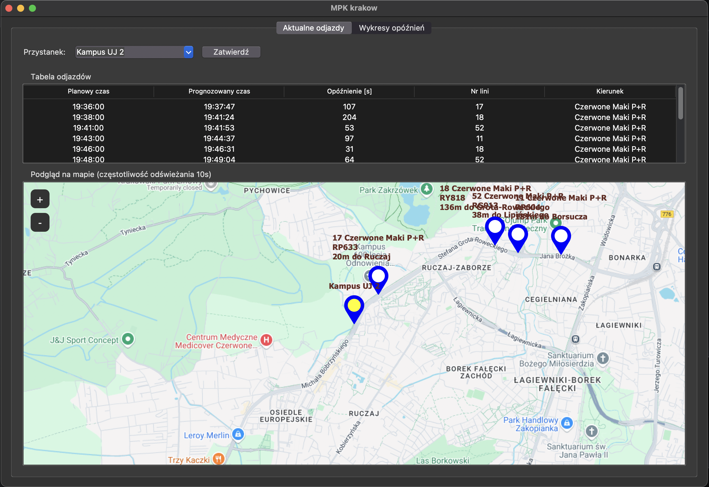
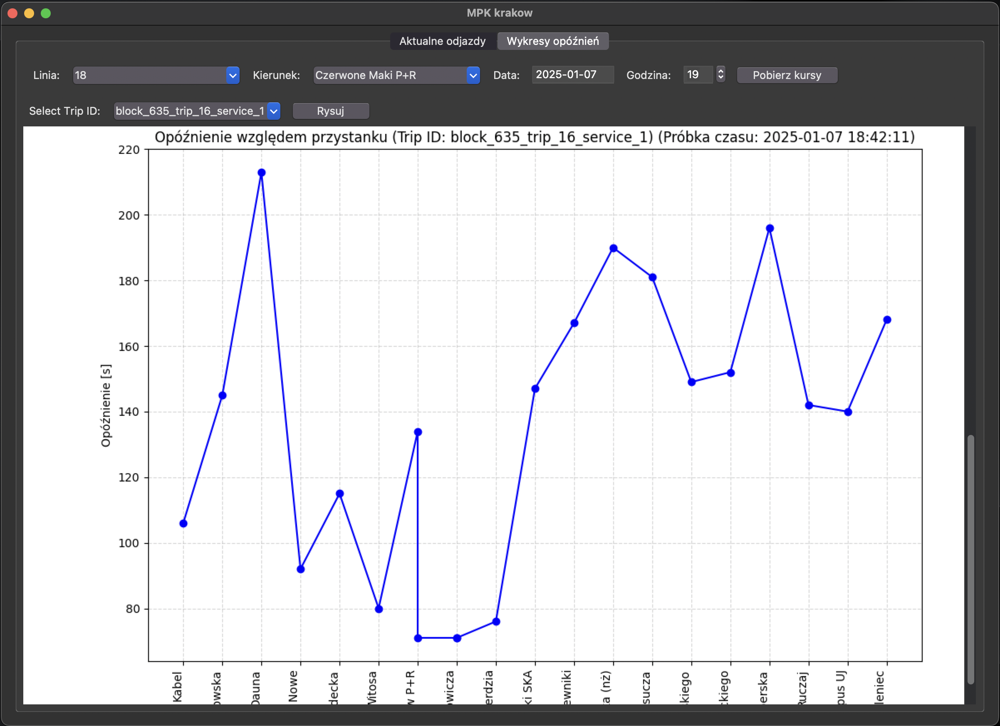

# 🛠️ Pozycjonowanie pojazdów MPK Kraków
Aplikacja z prostym interfejsem użytkownika, tablica aktualnych odjazdów tramwajów w Krakowie.

Dodatkową funkcjonalnością aplikacji jest zapisywanie opóźnienia kursu względem przystanku.

Można tworzyć kilka wykresów naraz w celu porównania kursów, jeśli tramwaj jeszcze nie dojechał do przystanku to bazujemy na predykcji opóźnienia.

# Jak uruchomić
```sh
git clone https://github.com/k1m4ti/MPK_Krakow_Viewer.git
```

```sh
pip install -r requirements.txt
```

uruchomienie pobierania danych
```sh
python database.py
```

uruchomienie interfejsu uzytkownika
```sh
python frontend.py
```

Nalezy gdzieś hostować serwer mysql.
# 🗂️ Pozyskiwanie danych
Dane są cyklicznie pobierane ze strony https://gtfs.ztp.krakow.pl/ .\
Dane z postaci [protocol buffer](https://gtfs.org/documentation/realtime/reference/#protocol-buffer-data-types)
```
header {
gtfs_realtime_version: "2.0"
incrementality: FULL_DATASET
timestamp: 1736276833
}
entity {
id: "block_165_trip_15"
trip_update {
trip {
trip_id: "block_165_trip_15_service_1"
}
vehicle {
id: "9"
}
stop_time_update {
stop_id: "stop_1626_311102"
arrival {
time: 1736276838
}
departure {
time: 1736276838
}
}
stop_time_update {
stop_id: "stop_1654_314104"
arrival {
time: 1736276958
}
departure {
time: 1736276958
}
}
stop_time_update {
stop_id: "stop_237_31904"
arrival {
time: 1736277018
}
departure {
time: 1736277018
}
```
przekształcam na obiekt pd.dataframe
| trip_id | stop_id                     | arrival_time          | departure_time        |
|---------|-----------------------------|-----------------------|-----------------------|
| block_167_trip_21_service_3      | block_142_trip_18_service_3 | stop_330_254319       | 2025-01-05 20:55:28   | 2025-01-05 20:55:28   |
| block_166_trip_20_service_3     | block_142_trip_18_service_3 | stop_571_303719       | 2025-01-05 20:56:28   | 2025-01-05 20:56:28   |
| block_165_trip_16_service_3     | block_142_trip_18_service_3 | stop_252_42019        | 2025-01-05 20:57:28   | 2025-01-05 20:57:28   |
| block_164_trip_21_service_3     | block_142_trip_18_service_3 | stop_354_274529       | 2025-01-05 21:00:28   | 2025-01-05 21:00:28   |
| block_146_trip_17_service_3     | block_142_trip_18_service_3 | stop_313_86719        | 2025-01-05 21:01:28   | 2025-01-05 21:01:28   |

oraz dane o pozycjach pojazdów na taki obiekt:
```
header {
gtfs_realtime_version: "2.0"
incrementality: FULL_DATASET
timestamp: 1736277164
}
entity {
id: "2"
vehicle {
trip {
trip_id: "block_143_trip_11_service_1"
}
vehicle {
id: "2"
label: "2"
license_plate: "DN002"
}
position {
latitude: 50.0718498
longitude: 19.9289246
bearing: 225
}
current_stop_sequence: 17
stop_id: "stop_55_7904"
timestamp: 1736277064
}
}
```
| trip_id                  | license_plate | latitude   | longitude   | stop_id       | timestamp           |
|--------------------------|---------------|------------|-------------|---------------|---------------------|
| block_167_trip_21_service_3 | RF303        | 50.086746  | 19.933056   | stop_183_6129 | 2025-01-05 20:54:13 |
| block_166_trip_20_service_3 | RF306        | 50.073742  | 20.017569   | stop_246_40839| 2025-01-05 20:54:10 |
| block_165_trip_16_service_3 | RF307        | 50.092030  | 20.061075   | stop_342_268529| 2025-01-05 20:54:09|
| block_164_trip_21_service_3 | RF315        | 50.073582  | 20.016459   | stop_246_40829| 2025-01-05 20:54:09 |
| block_146_trip_17_service_3 | RF318        | 50.052990  | 19.913855   | stop_342_268529| 2025-01-05 20:54:08|

oraz korzystając z zaplanowanego rozkładu manipuluję danymi aby miały jakiś sens i były zrozumiałe dla uyżtkownika. Tak przygotowane dataframe są po obrobieniu zapisywane do bazy danych MySql. Informacje o opóźnieniach są dopisywane do tabeli, a reszta danych jest nadpisywana.